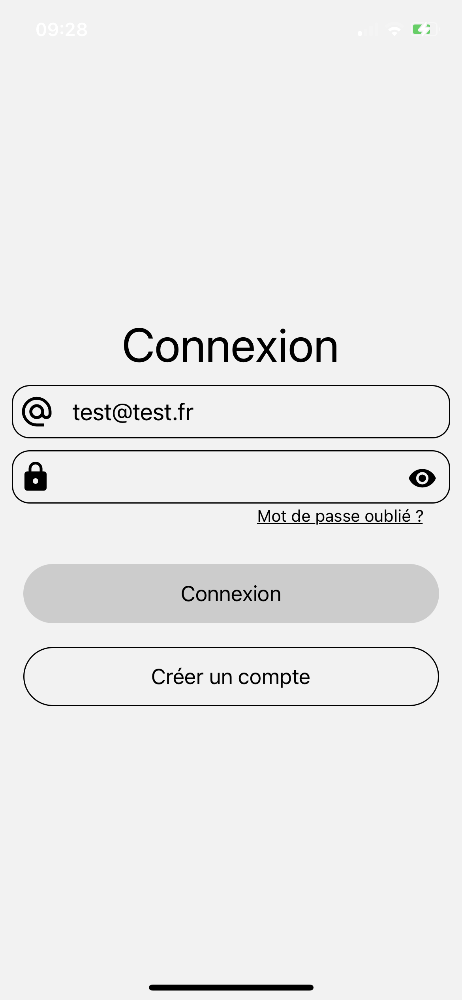
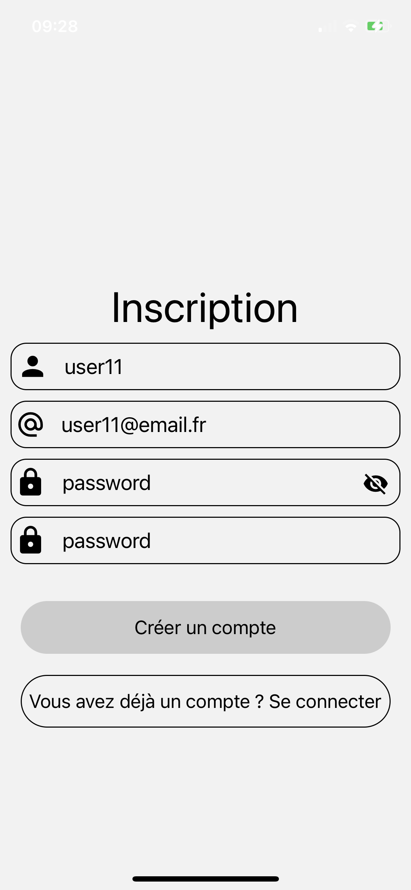
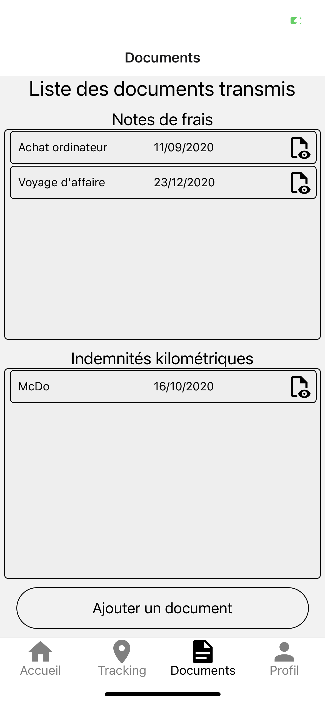

# CabinetPlus
Projet personnel de création d'une application (et d'un site web) permettant à un cabinet d'expertise comptable de pouvoir visualiser les déplacements de ses clients pour les utiliser dans les notes de frais.

## Avancement:   
* Ecrans :construction:  
* Interfaces :construction:  
* Interactions :construction:  
* **Sécurité/Confidentialité** :construction:  

## Technologies/Langages utilisés:  
* Expo (React native)   
* Inscription/Connexion avec Firebase (pour le moment, avant migration sur l'API)
* API :construction:

## Images:
* Ecran de connexion (page de démarrage si l'utilisateur n'est pas connecté):

* Ecran d'inscription:

* Ecran d'affichage des documents:

